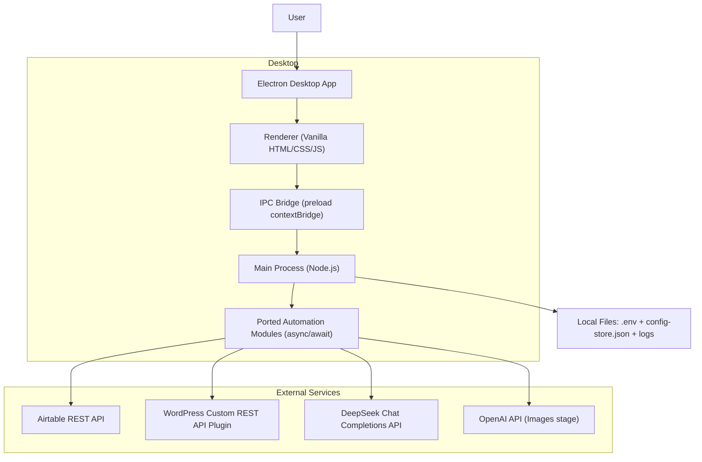

# FTS Trip Manager — Technical Architecture

## 1. Architecture Overview
The application is a single Electron desktop app:
- Main process: Node.js runtime hosting the ported automation modules, scheduler, and IPC handlers.
- Renderer: vanilla HTML/CSS/JS UI with simple client-side routing (hash-based or manual page switching).



## 2. Technology Constraints
- UI must be vanilla HTML/CSS/JS (no React/Vue, no TypeScript, no Vite, no Tailwind).
- All ported modules use async/await.
- AI prompt text is embedded as immutable strings/resources and must be copied verbatim from the GAS source.

## 3. Folder Structure (Must Match)
```
fts-trip-manager/
├── src/
│   ├── config/
│   │   ├── app-config.js
│   │   ├── migration-config.js
│   │   └── config-store.js
│   ├── core/
│   │   ├── http-client.js
│   │   ├── airtable-client.js
│   │   ├── state-service.js
│   │   └── lock-service.js
│   ├── import/
│   │   ├── wp-fetch.js
│   │   ├── sync-runner.js
│   │   ├── mapper.js
│   │   └── upsert.js
│   ├── ai/
│   │   ├── ai-provider.js
│   │   ├── context-utils.js
│   │   ├── enhancement-helpers.js
│   │   ├── orchestrator.js
│   │   ├── seo-enhancer.js
│   │   ├── content-enhancer.js
│   │   ├── addons-enhancer.js
│   │   ├── highlights-enhancer.js
│   │   ├── itinerary-enhancer.js
│   │   ├── inc-exc-enhancer.js
│   │   ├── trip-facts-enhancer.js
│   │   ├── faqs-enhancer.js
│   │   └── images-enhancer.js
│   ├── publish/
│   │   ├── publisher.js
│   │   └── updater.js
│   ├── migration/
│   │   ├── migration-mapper.js
│   │   ├── migration-runner.js
│   │   └── migration-test.js
│   ├── scheduler/
│   │   └── task-scheduler.js
│   └── logger/
│       └── app-logger.js
├── main.js
├── preload.js
├── renderer/
│   ├── index.html
│   ├── styles/
│   │   └── app.css
│   ├── app.js
│   ├── pages/
│   │   ├── dashboard.js
│   │   ├── import.js
│   │   ├── ai-pipeline.js
│   │   ├── publisher.js
│   │   ├── migration.js
│   │   ├── scheduler.js
│   │   ├── settings.js
│   │   └── logs.js
│   └── components/
│       ├── trip-card.js
│       ├── stage-badge.js
│       ├── log-viewer.js
│       └── sidebar.js
├── data/
│   ├── config-store.json
│   └── logs/
├── package.json
├── .env
└── electron-builder.yml
```

## 4. Routes (8 Pages)
| Route | Purpose |
|-------|---------|
| `/dashboard` | Trip status overview, summary, filters, auto-refresh |
| `/import` | Import controls + import state + progress |
| `/ai-pipeline` | Stage monitoring + per-stage + per-trip controls |
| `/publisher` | Publisher (create) and Updater (update) workflows |
| `/migration` | Test/full migration + reset counter + migration logs |
| `/scheduler` | Cron task management + run now + start/stop all |
| `/settings` | `.env` configuration + per-service connection tests |
| `/logs` | Live logs with filters/search/export |

## 5. IPC Surface (Must Include All Channels)

### 5.1 Renderer → Main (invoke)
```
config:get
config:set

import:run
import:single
import:reset

pipeline:check
pipeline:detect-stuck

ai:run-stage
ai:reset-stage
ai:init-pipeline

publish:run
update:run
publish:toggle

migration:test
migration:run
migration:reset

scheduler:get-all
scheduler:update
scheduler:run-now
scheduler:start-all
scheduler:stop-all

trips:fetch-all
trips:fetch-one

settings:get
settings:save
settings:test
```

### 5.2 Main → Renderer (events)
```
log:entry
task:started
task:completed
task:error
trips:updated
```

### 5.3 IPC Contract Notes
- `ai:run-stage` supports independent stage execution:
  - If `tripId` is provided, run the stage for that trip only.
  - If `tripId` is omitted, run the stage batch (all Pending trips for that stage).

## 6. Key Workflows

### 6.1 Import (WordPress → Airtable)
- Uses the ported `wp-fetch` and `sync-runner` to page through WP trips and upsert them into Airtable.
- Import state persists locally (replacing ScriptProperties) while canonical trip data lives in Airtable.

### 6.2 AI Enhancement (Airtable → AI → Airtable)
- Nine independent stage runners exist and can be triggered in batch or per-trip.
- Orchestrator can progress stages sequentially, but UI must allow skipping/re-running stages.
- All prompts and field names remain unchanged.

### 6.3 Publishing (Airtable → WordPress)
- Publisher creates new trips.
- Updater updates existing trips and applies preservation logic.
- Workflows are separate modules and separate IPC entry points.

## 7. Storage
- `.env`: user-managed secrets and connection configuration.
- `data/config-store.json`: mutable state (import state, schedules, runtime counters).
- `data/logs/`: log files; log events also stream to the renderer via IPC.
